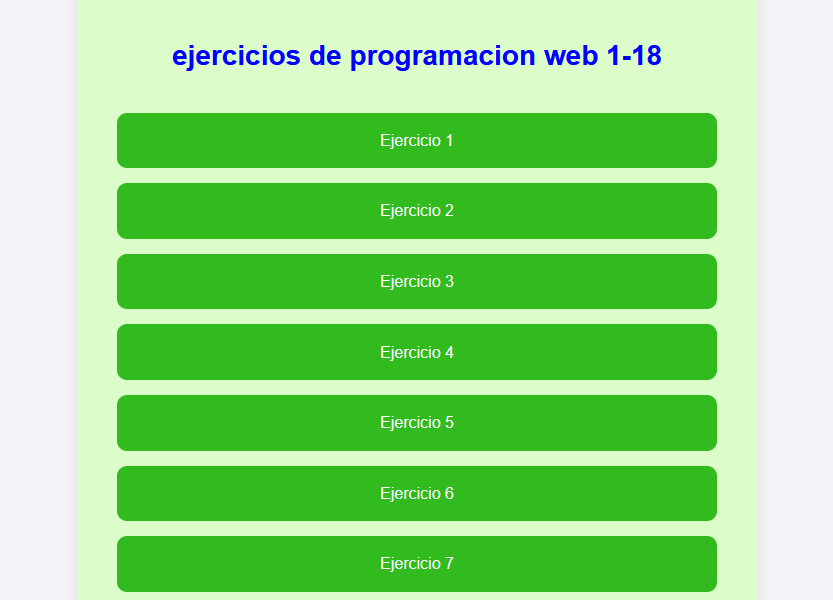
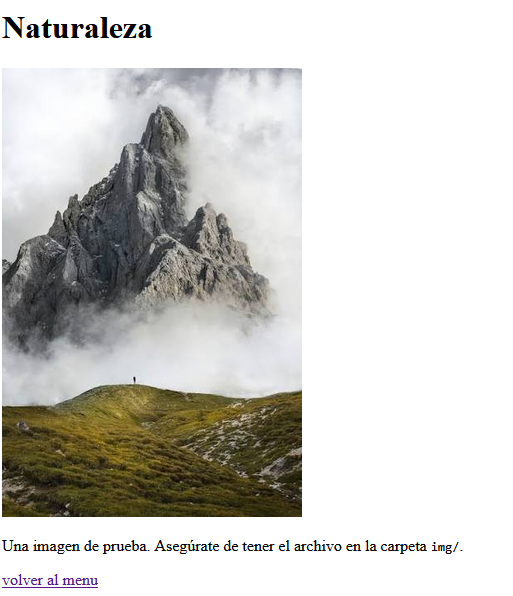
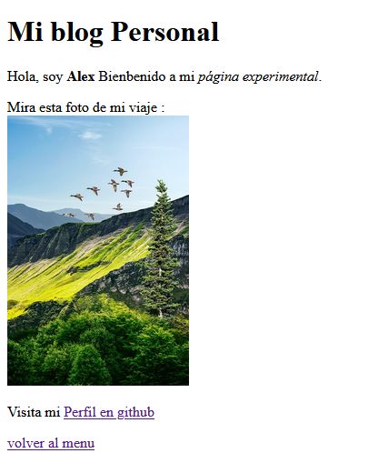
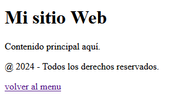
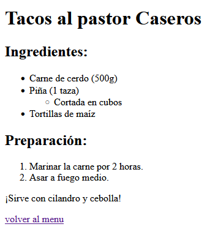
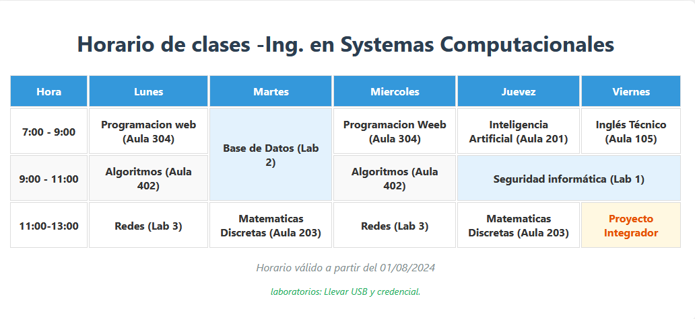
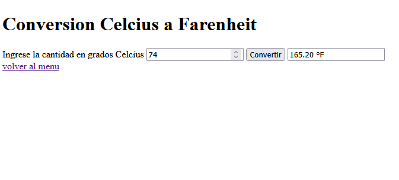

# ejercicios del 1 al 18 de html, js y javaScript

Alumno santiago Ramirez Erick Omar


para el menu pricipal cree unarchivo index.html que es lo priemro que se muestra en el proyecto en github pages y mediante enlaces redireccione a cada ejercicio para que sea mas facil de visualizar 



### ejercicio 1


codigo
```
<body>
    <h1>¡Hola Mundo!</h1>
    <p>Esta es mi primer Ejercicio de HTML.</p>
    <a href="index.html">volver al menu</a>
</body>
```
etiquetas usadas
h1 para titulos
p para crear parrafos


```
<body>
    <h1>Mi primera página con Formato</h1>
    <p>Este es un <strong>párrafo importante </strong>.<br>
    Y este tiene <em>énfasis</em>.</p>
    <p>Segundo párrafo para practicar.</p>
    <a href="index.html">volver al menu</a>
</body>
```
etiquetas

strong
em


```
<!DOCTYPE html>
<html lang="en">
<head>
    <meta charset="UTF-8">
    <meta name="viewport" content="width=device-width, initial-scale=1.0">
    <title>Ejercicio 3- Enlaces</title>
</head>
<body>
    <h1>Enlaces de Práctica</h1>
    <p><a href="https://www.google.com" target="_blank">google ( nueva pestaña)</a></p>
    <p><a href="https://www.facebook.com" target="_self">Vista a facebook (misma pestaña)</a></p>
    <p>O regresa  al <a href="ejercicio1.html">ejercicio1</a>.</p>
    <a href="index.html">volver al menu</a>
</body>
</html>
```

### ejercicio 4



```
<body>
    <h1>Naturaleza</h1>
    
    <p>Una imagen de prueba. Asegúrate de tener el archivo en la carpeta <code>img/</code>. </p>
    <a href="index.html">volver al menu</a>
</body>
```

code

## ejercicio 5 
etiquetas:
br: hacer un salto de linea 
img agregar una imagen -> propiedades alt="texto alternativo si no aparece la imagen "





## ejercicio 6



etiquetas usadas:
```
<header>
<section>
</footer>
```

## ejercicio 7
el ejercicio consiste en hacer una lista mediante biñetas


etiquetas 
```
<ul>
<li>
<ol>
<li>
```

## Ejercicio 8

consiste en hacer un horario mediante una tabla en html y se le agregaron estilos en un archovo css separado


etiquetas
``` 
<link
<table
<thead>
<tbody>
<ht>
```

ejercicio 9 

se crea un formulario usando cajas de texto con texto predefinido como ejemplo usando la propiedad placeholder en etiquetas input


etiquetas 
```
<div
<form
<label
<input
<buttom>
```


## ejercicio 10 conversion de termperatura

se crea 1 calculadora ocupando un input para ingresar un valor y al presionar el boton "convertir" convierta la cantidad de grados celcius a Farenheith y agrega el resultado en otro input al cual no se puede editar el contenido 


cosas importante 
la funcionalidad se impleneta mediante un archvo externo js y ha agrega al html con la linea

```
<script src="js/ejercicio10.js"></script>
```

y se agreaga la funcion con el evento  onclick en el boton 
```
<button type="button" onclick="convertir()">Convertir</button>
```
