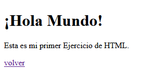
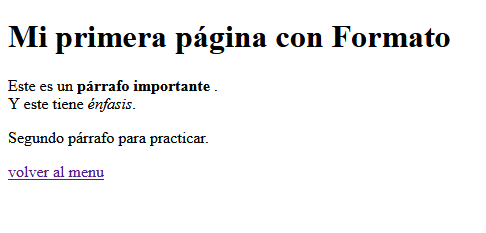
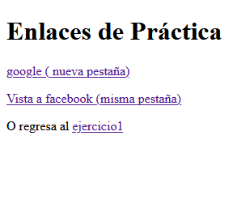

# ejercicios del 1 al 18 de html, js y javaScript

Alumno santiago Ramirez Erick Omar

### ejercicio 1



codigo
```
<body>
    <h1>¡Hola Mundo!</h1>
    <p>Esta es mi primer Ejercicio de HTML.</p>
    <a href="index.html">volver al menu</a>
</body>
```
etiquetas usadas
h1 para titulos
p para crear parrafos



```
<body>
    <h1>Mi primera página con Formato</h1>
    <p>Este es un <strong>párrafo importante </strong>.<br>
    Y este tiene <em>énfasis</em>.</p>
    <p>Segundo párrafo para practicar.</p>
    <a href="index.html">volver al menu</a>
</body>
```
etiquetas
strong
em




```
<!DOCTYPE html>
<html lang="en">
<head>
    <meta charset="UTF-8">
    <meta name="viewport" content="width=device-width, initial-scale=1.0">
    <title>Ejercicio 3- Enlaces</title>
</head>
<body>
    <h1>Enlaces de Práctica</h1>
    <p><a href="https://www.google.com" target="_blank">google ( nueva pestaña)</a></p>
    <p><a href="https://www.facebook.com" target="_self">Vista a facebook (misma pestaña)</a></p>
    <p>O regresa  al <a href="ejercicio1.html">ejercicio1</a>.</p>
    <a href="index.html">volver al menu</a>
</body>
</html>
```

### ejercicio 4


```
<body>
    <h1>Naturaleza</h1>
    
    <p>Una imagen de prueba. Asegúrate de tener el archivo en la carpeta <code>img/</code>. </p>
    <a href="index.html">volver al menu</a>
</body>
```

code